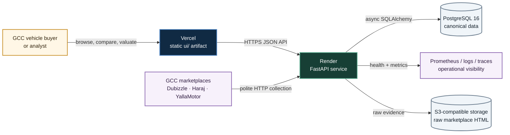
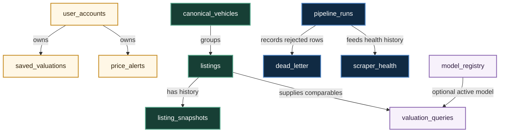
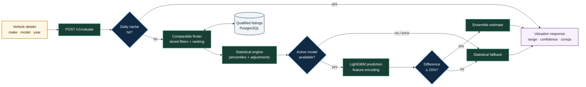
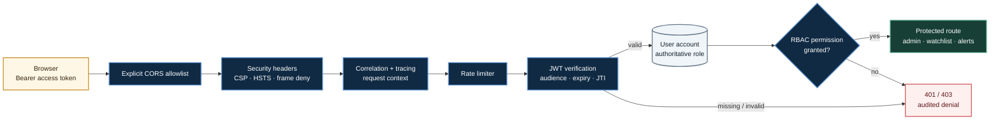
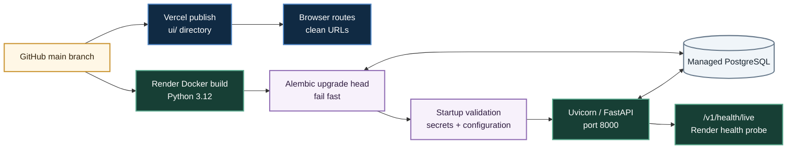

# GCC Car Value Platform

## Architecture & Workflow Guide

**As-built review:** 2 August 2026  
**Scope:** current working tree, production topology, core data paths, and known integration boundaries  
**Audience:** engineers, operators, product owners, and technical reviewers

> **In one sentence:** GCC Car Value is a static web application backed by a FastAPI service that turns normalized Gulf vehicle listings into explainable market valuations, with PostgreSQL as the system of record and an optional ML estimate layered over a statistical baseline.

---

## Reading guide

This is an **explanation and reference document**, not a claim that every module is production-complete. It uses three status labels throughout:

| Status | Meaning |
|---|---|
| **Active path** | Imported or invoked by the current application and part of a live request, startup, or deployment path. |
| **Available foundation** | Implemented in the repository, but not yet connected end-to-end. |
| **Preview / transitional** | User-facing or operational code that intentionally falls back to demo behavior, local state, or a partial implementation. |

The source code is authoritative. Older planning and audit documents are useful context, but several large legacy module trees are currently marked for deletion and are not described here as live architecture.

---

# 1. Executive overview

The platform has four central responsibilities:

1. **Present the product.** Static pages under `ui/` provide vehicle browsing, valuation forms, market reports, comparison views, authentication, watchlists, notifications, and settings.
2. **Collect market evidence.** Source-specific scrapers fetch GCC marketplace pages, retain raw HTML in S3-compatible storage, and parse source fields.
3. **Produce explainable valuations.** The API searches PostgreSQL for comparable listings, calculates percentile bands and market adjustments, and optionally blends an active LightGBM model when it agrees with the statistical estimate.
4. **Operate safely.** Startup validation, migrations, CORS, security headers, JWT/RBAC, health checks, structured logs, metrics, tracing, and rate limiting protect and expose the service.

The clearest architectural principle is **statistical-first valuation**. Machine learning is optional. If the model is missing, fails, or disagrees with the statistical estimate by more than 15%, the API still returns the explainable statistical result.

The clearest current limitation is **integration consistency**. The ingestion stages exist but are not invoked by the active scraper runner; several new static pages use preview data or same-origin API URLs that do not match the Vercel/Render split; and token revocation remains process-local.

---

# 2. System context

The production source of truth for the frontend is the static `ui/` directory. Vercel publishes it. Render builds and runs the FastAPI API from `docker/Dockerfile.api`. PostgreSQL stores accounts, listings, pipeline state, valuation cache entries, and ML registry metadata.



### Runtime ownership

| Concern | Production owner | Source of truth |
|---|---|---|
| Browser application | Vercel | `ui/` and `vercel.json` |
| HTTP API | Render | `src/api/main.py` and `docker/Dockerfile.api` |
| Relational data | PostgreSQL 16 | SQLAlchemy models and Alembic migrations |
| Raw scrape evidence | S3-compatible object storage | `src/scrapers/raw_storage.py` |
| Secrets | Explicit provider: environment or AWS | `src/config/secrets.py` |
| Telemetry | Prometheus format, structured logs, optional tracing | `src/core/metrics`, `src/core/logging`, `src/core/tracing` |

FastAPI can also mount `ui/` for integrated local development. That fallback is convenient, but it is not the production frontend host.

---

# 3. Repository map

```text
ui/                         Static production frontend
src/api/                    FastAPI application, middleware, schemas, routes
src/auth/                   JWT authentication and RBAC authorization
src/config/                 Settings, secret providers, startup validation
src/core/                   Context, health, logging, metrics, tracing
src/db/                     Async SQLAlchemy sessions and Alembic migrations
src/models/                 PostgreSQL domain and operational models
src/scrapers/               Active scraper base and source implementations
src/pipeline/               Validation, normalization, quality, promotion
src/engine/                 Comparable search and statistical valuation
src/ml/                     Model persistence, loading, and prediction adapter
docker/                     API and scraper container definitions
.github/workflows/          CI, backup, and keep-alive automation
docs/                       Deployment, rollback, audits, and this guide
```

### Architectural layers

| Layer | Responsibility | Representative modules |
|---|---|---|
| Experience | Page rendering and browser interactions | `ui/*.html`, `ui/js/index.js`, `ui/detail-pages.js` |
| API edge | Validation, routing, rate limiting, middleware | `src/api/main.py`, `src/api/routes/*` |
| Identity | Password hashing, JWTs, roles, permissions | `src/auth/*`, `src/models/user_account.py` |
| Domain | Comparables, valuation, recommendations | `src/engine/*` |
| Data acquisition | Marketplace fetch and parse | `src/scrapers/*` |
| Data quality | Validate, normalize, score, promote | `src/pipeline/*` |
| Persistence | Sessions, models, migrations | `src/db/*`, `src/models/*` |
| Operations | Health, metrics, logs, traces | `src/core/*`, `src/observability/*` |

---

# 4. Frontend architecture and page workflow

The frontend is intentionally build-free: Vercel publishes HTML, CSS, JavaScript, and images directly from `ui/`. `cleanUrls=true` maps `/reports` to `reports.html`, and `ui/routes.manifest.json` defines the routes expected to return HTTP 200.

### Page families

| Family | Routes | Current behavior |
|---|---|---|
| Public valuation | `/`, `/browse`, `/results`, `/vehicle`, `/comparables` | Main valuation flow calls the API; detail pages mix live lookups and designed fallback states. |
| Market intelligence | `/market`, `/reports`, `/report-detail` | Visual analytics experience; some model/listing counts are live, while charts, reports, and insights remain preview data. |
| Account workspace | `/auth`, `/watchlist`, `/notifications`, `/settings` | Backend foundations exist; integration varies by page and settings remain browser-local. |

The browser chooses API endpoints in two different ways:

- `ui/js/index.js` points production traffic explicitly to `https://gcc-car-value.onrender.com/v1`.
- Several dedicated pages use an empty production `BASE`, producing same-origin calls such as `/v1/auth/login` on Vercel.

Because `vercel.json` has no API rewrite, those same-origin calls do not automatically reach Render. This is the most important frontend topology mismatch to resolve: use one shared API-base module or add an explicit Vercel rewrite.

### Browser state

- Access and refresh tokens are stored in `localStorage` by `auth.html`.
- The primary UI still keeps recent makes, some watchlist actions, and settings in `localStorage`.
- Dedicated watchlist and notification pages attempt API reads, but retain demo content when the API is unavailable.
- `detail-pages.js` visibly marks designed pages as **Preview data — Not connected to a live workspace** and disables misleading report/save actions.

This fallback strategy makes the UI demonstrable, but it also means a visually populated page is not proof of connected production data.

---

# 5. Marketplace ingestion workflow

Three active scraper implementations are present:

- Dubizzle UAE
- Haraj KSA
- YallaMotor, parameterized for UAE, Saudi Arabia, Qatar, Kuwait, Bahrain, and Oman

The base scraper provides an `httpx.AsyncClient`, randomized browser-like user agents, transport retries, a token-bucket rate limiter, raw HTML upload, per-listing error capture, and a circuit breaker after ten consecutive failures.

```mermaid title="Ingestion pipeline and current integration boundary" page=landscape
flowchart LR
    M["Marketplace pages"]
    F["Fetch index + listing<br/>httpx session"]
    R["Rate limiter<br/>retry + circuit breaker"]
    S[("Raw HTML<br/>S3-compatible bucket")]
    X["Site parser<br/>source fields"]
    V["Pandera validation"]
    N["Canonical normalization<br/>currency → AED"]
    Q["Quality scoring"]
    D{"Score ≥<br/>threshold?"}
    L[("Listings<br/>insert or update")]
    E[("Dead-letter<br/>rejected records")]
    P[("Pipeline run<br/>audit record")]

    M --> F --> R --> S
    R --> X
    X -. "integration gap" .-> V
    V --> N --> Q --> D
    D -->|"yes"| L
    D -->|"no"| E
    X --> P

    classDef live fill:#173f35,stroke:#58a88c,color:#fff,stroke-width:2px;
    classDef module fill:#fff7e6,stroke:#c9922e,color:#33240d,stroke-width:2px;
    classDef store fill:#f0f5f9,stroke:#66788a,color:#14202b,stroke-width:2px;
    classDef gap fill:#fff0f0,stroke:#cf5c5c,color:#5b1515,stroke-width:2px,stroke-dasharray:5 4;
    class M,F,R,X live;
    class V,N,Q,D module;
    class S,L,E,P store;
```

### Stage-by-stage behavior

| Stage | What it does | Status |
|---|---|---|
| Discovery | Scraper-specific index requests find listing URLs. | Active path |
| Fetch | Each listing is retrieved through the shared async session and rate limiter. | Active path |
| Raw retention | HTML is stored under `raw/<source>/<run_id>/<uuid>.html`. | Active path, requires S3 access |
| Parse | Site parsers extract make, model, year, mileage, price, spec, city, country, and source identifiers. | Active path |
| Validate | Pandera enforces required fields, ranges, country codes, and suspicious-price rules. | Available foundation |
| Normalize | Makes, specifications, cities, and currencies are normalized; prices become AED. | Available foundation |
| Score | Optional-field gaps and outliers reduce a 100-point quality score. | Available foundation |
| Promote | Qualified rows insert/update `listings`; low-scoring rows enter `dead_letter`. | Available foundation |
| Audit | A `pipeline_runs` row records counts, duration, versions, and errors. | Active path |

### Important as-built boundary

`BaseScraper.run()` parses rows and counts them, but it does not call `validate_listing()`, `normalize_listing()`, `score_quality()`, or `promote_listing()`. `PipelineOrchestrator` records the scraper result but also does not invoke those stages. The boxes exist; the connector between parsing and canonical persistence does not.

Until that gap is closed, newly scraped records are not guaranteed to reach the `listings` table that powers model discovery and valuation.

---

# 6. Listing lifecycle and storage

The relational model separates market facts, operational evidence, account data, and model metadata.



Key records include:

- **`listings`** — normalized asking price, source identity, vehicle attributes, quality score, lifecycle status, lineage versions, and raw S3 key.
- **`listing_snapshots`** — time-series history for a listing.
- **`valuation_queries`** — daily cache and audit record for valuation responses.
- **`model_registry`** — model status, metrics, features, path, and activation timestamps.
- **`user_accounts`**, **`saved_valuations`**, and **`price_alerts`** — private account data scoped by user ID.
- **`pipeline_runs`**, **`scraper_health`**, and **`dead_letter`** — operational controls for ingestion.

Alembic owns schema evolution. The API container runs `alembic upgrade head` before Uvicorn and stops if migration fails.

---

# 7. Valuation request workflow

The primary endpoint is `POST /v1/valuate`. A second endpoint, `POST /v1/valuate-url`, fetches and parses a supplied listing URL before calling the same statistical engine.



### Comparable selection

The comparable finder expands through three tiers until it finds enough evidence:

| Tier | Year range | Mileage range | Same spec | Same country |
|---|---:|---:|---|---|
| 1 | ±2 years | ±30% | Yes | Yes |
| 2 | ±3 years | ±50% | No | Yes |
| 3 | ±4 years | ±75% | No | No |

Only listings with quality score at least 60 and an accepted lifecycle status are considered. Each candidate receives a relevance score based on recency, mileage distance, year distance, specification, country, data quality, and evidence of sale.

### Statistical estimate

The statistical engine requires at least five comparables. It then:

1. Calculates the segment median and 10th/90th percentile market range.
2. Adjusts the point estimate for mileage relative to the comparable median.
3. Applies a partial GCC-spec premium or non-GCC discount when evidence exists.
4. Applies a partial city-level market adjustment.
5. Assigns high, medium, or low confidence from sample size, price dispersion, and recency.
6. Produces a bootstrapped 80% confidence interval.
7. Returns up to ten attributed comparables without exposing marketplace URLs.

If the caller includes an asking price, the API labels it as a great deal, fair deal, or above market when confidence is sufficient.

### Optional ML layer

`ModelLoader` queries `model_registry` for the latest active model and loads the corresponding pickle from `src/ml/models/`. The prediction adapter converts vehicle and market context into the expected feature frame.

- No active model: use statistical result.
- Prediction error: use statistical result and set `fallback_used=true`.
- ML/statistical difference above 15%: retain statistical result and log the disagreement.
- Difference at or below 15%: average the two estimates and label the source `ensemble`.

This is a resilient design, but filesystem-local model storage means the production image must actually contain or obtain the active model artifact. The current Dockerfile copies `src/`, while model files are generally gitignored; model distribution therefore needs an explicit release mechanism.

---

# 8. API surface

All routes except `/metrics` are mounted under `/v1`.

| Area | Endpoints | Access |
|---|---|---|
| Health | `GET /health`, `/health/live`, `/health/ready`, `/health/startup` | Public |
| Market catalog | `GET /models`, `/models/{make}`, `/models/{make}/{model}` | Public |
| Valuation | `POST /valuate`, `POST /valuate-url` | Public, rate-limited |
| Authentication | `POST /auth/register`, `/auth/login`, `/auth/refresh`, `/auth/logout`; `GET /auth/me` | Mixed |
| Workspace | `GET/POST/DELETE /watchlist`; `GET /notifications` | Bearer token |
| Administration | `GET /admin/stats`, `/admin/scrapers`, `/admin/quality` | Permission-gated |
| Metrics | `GET /metrics` | Public in current routing |

`/models` endpoints deliberately return empty collections with an error message when the database is unavailable, allowing frontend fallback states. Valuation endpoints fail explicitly when evidence is insufficient.

---

# 9. Authentication, authorization, and request security

Accounts use email plus PBKDF2-SHA256 password hashes with per-user salts. Access tokens use HS256 JWTs with a 15-minute expiry; refresh tokens expire after seven days.



### Security controls

- Explicit CORS origins; credentialed CORS is disabled for bearer-token auth.
- Content Security Policy, frame denial, content-type protection, referrer policy, and deployed-environment HSTS.
- Global SlowAPI rate limiting plus tighter registration, login, refresh, logout, and valuation limits.
- JWT audience, expiry, token type, and JTI checks.
- Database-backed role lookup with JWT role as fallback.
- Declarative permissions for admin metrics, scraper state, and quality metrics.
- User ID predicates on watchlist and notification queries.
- Audit logging for denied authorization attempts.

### Current security boundaries

- Revoked JTIs are stored in process memory and disappear on restart or across multiple instances.
- Refresh-token rotation revokes the used token, but the refreshed access token currently hard-codes the `consumer` role instead of reading the current role from the database.
- Logout revokes the presented access token; the associated refresh token is not directly revoked by that call.
- Browser tokens are stored in `localStorage`, which makes a strong CSP and XSS prevention especially important.

---

# 10. Secrets and startup lifecycle

`SECRET_PROVIDER` explicitly selects `environment` or `aws`. It is not inferred from the deployment environment, so Render production can safely use environment variables without accidentally attempting AWS Secrets Manager.

Production and staging call `validate_startup()` from FastAPI lifespan before accepting traffic. The validator checks required secret presence, minimum length, weak/default patterns, JWT complexity, and database URL format.

Required production configuration includes:

| Variable | Purpose |
|---|---|
| `SECRET_PROVIDER` | Select environment variables or AWS Secrets Manager. |
| `JWT_SECRET` | Sign and verify access and refresh tokens. |
| `DATABASE_URL` | Async runtime database connection. |
| `DATABASE_URL_SYNC` | Migration and tooling connection. |
| `API_CORS_ORIGINS` | Exact browser origins allowed to call the API. |
| `ENVIRONMENT` | Controls deployed-only validation, HSTS, and runtime behavior. |

Optional secrets include S3 credentials, Claude API access, and VIN API access.

---

# 11. Health, observability, and failure behavior

The health registry runs registered checks concurrently with individual timeouts.

| Probe | Purpose | Dependencies |
|---|---|---|
| `/v1/health/live` | Confirms the event loop and process respond. | None |
| `/v1/health/ready` | Determines whether critical dependencies can serve traffic. | Critical registered checks |
| `/v1/health/startup` | Startup-probe view of readiness. | Critical registered checks |
| `/v1/health` | Full dependency report with healthy/degraded/unhealthy aggregation. | Database, memory, configuration, secrets, metrics registry |

The database check verifies connectivity and that the `alembic_version` table can be queried. It does not currently compare the installed revision with Alembic head, so “migrations: ok” means migration metadata is reachable, not necessarily current.

Operational signals include:

- Structured logs through `structlog`.
- Correlation IDs attached by middleware.
- Optional HTTP and database tracing when OpenTelemetry is enabled.
- In-process metrics exported in Prometheus text format at `/metrics`.
- Application version, environment, runtime, uptime, and health-check metrics.

Telemetry failures are intentionally non-fatal. Metrics and tracing must never prevent the valuation service from starting or answering requests.

---

# 12. Deployment and release workflow



### Frontend release

Vercel publishes `ui/` without a build command. It applies no-cache headers broadly, HSTS and security headers, one-day image caching, and clean URL routing. CI serves the same directory locally and checks the route manifest plus internal script/link references.

### API release

Render builds `docker/Dockerfile.api` from `main`, injects secrets and database URLs, and probes `/v1/health/live`. The container:

1. Installs production dependencies.
2. Copies `src/`.
3. Drops privileges to a non-root user.
4. Executes `alembic upgrade head`.
5. Starts Uvicorn with `exec`, preserving graceful signal handling.

The migration and application startup are still in one container command. This is fail-fast, but a platform release job would separate schema change from service process startup more cleanly.

### CI gates

GitHub Actions currently covers:

- Ruff linting
- Mypy type checking
- Python tests with coverage
- Alembic upgrade/downgrade/upgrade validation
- Docker image build
- Static frontend route checks
- Internal HTML and script reference checks
- Dependency audit as a warning

Browser-level smoke testing is only partially represented: Playwright is installed, but the workflow shown does not yet run full per-route interaction, mobile viewport, accessibility, or console-error scenarios.

---

# 13. Local development workflow

### API plus integrated static UI

```bash
# Configure .env first, including a non-empty JWT_SECRET.
pip install -e ".[dev]"
alembic -c src/db/migrations/alembic.ini upgrade head
uvicorn src.api.main:app --reload --host 0.0.0.0 --port 8000
```

Open `http://localhost:8000/`. FastAPI serves the static UI as a local fallback.

### Split frontend and API

```bash
python -m http.server 3000 --directory ui
uvicorn src.api.main:app --reload --host 127.0.0.1 --port 8000
```

Pages that explicitly detect port 3000 call `127.0.0.1:8000`. The main script calls `localhost:8000/v1` on localhost.

### Docker Compose

The compose stack defines the API, PostgreSQL with pgvector, LocalStack S3, and MLflow. It is best understood as a development topology; the API service needs a `JWT_SECRET` environment value to satisfy the current settings validator.

---

# 14. Current boundaries and next integration moves

| Priority | Boundary | Why it matters | Smallest coherent next move |
|---:|---|---|---|
| 1 | Parsed scraper rows do not enter validation/normalization/promotion. | The valuation database cannot reliably refresh from active scrapers. | Add one transactional per-row ingestion service and call it from `BaseScraper.run()`. |
| 2 | Dedicated production pages use same-origin `/v1` calls on Vercel. | Auth, reports, notifications, and detail lookups can call the wrong host. | Centralize the API base or add an explicit Vercel rewrite to Render. |
| 3 | Preview analytics and reports remain hardcoded. | Designed KPI cards can be mistaken for live market intelligence. | Add report/aggregate APIs and replace each preview block with loading, empty, error, and stale states. |
| 4 | Watchlist and settings have mixed backend/local persistence. | Users can see inconsistent state across pages or devices. | Make authenticated API state canonical; use local storage only as a cache. |
| 5 | Token revocation is process-local. | Logout and rotation guarantees weaken across restart or scale-out. | Persist revoked refresh/access JTIs with expiry in PostgreSQL or Redis. |
| 6 | Active ML artifacts are local files. | A registry row may point to a model unavailable in the container. | Store versioned artifacts in object storage and download/verify on activation. |
| 7 | Health migration check is shallow. | A service may report migration metadata while still behind head. | Compare database revision with Alembic script head during readiness. |
| 8 | Metrics endpoint is public. | Operational detail may be exposed unnecessarily. | Restrict by private network, gateway policy, or authentication. |

---

# 15. Source reference appendix

## Runtime and deployment

- [`src/api/main.py`](../src/api/main.py) — application composition, lifespan, middleware, routers, and static fallback.
- [`vercel.json`](../vercel.json) — static frontend artifact, headers, caching, and clean URLs.
- [`render.yaml`](../render.yaml) — Render service, health path, and environment contract.
- [`docker/Dockerfile.api`](../docker/Dockerfile.api) — production image and fail-fast migration startup.
- [`.github/workflows/ci.yml`](../.github/workflows/ci.yml) — backend, migration, image, and frontend validation.

## Data acquisition and pipeline

- [`src/scrapers/base.py`](../src/scrapers/base.py) — active scraper lifecycle.
- [`src/scrapers/raw_storage.py`](../src/scrapers/raw_storage.py) — raw S3-compatible storage.
- [`src/pipeline/validator.py`](../src/pipeline/validator.py) — listing schema validation.
- [`src/pipeline/normalizer.py`](../src/pipeline/normalizer.py) — canonical values and AED conversion.
- [`src/pipeline/quality.py`](../src/pipeline/quality.py) — data-quality score.
- [`src/pipeline/promoter.py`](../src/pipeline/promoter.py) — listing upsert or dead-letter routing.
- [`src/pipeline/orchestrator.py`](../src/pipeline/orchestrator.py) — scraper batch coordination and run audit.

## Valuation and ML

- [`src/api/routes/valuation.py`](../src/api/routes/valuation.py) — cache, statistical baseline, optional ML, and response.
- [`src/engine/comp_finder.py`](../src/engine/comp_finder.py) — tiered comparable search and ranking.
- [`src/engine/statistical.py`](../src/engine/statistical.py) — estimate, range, adjustments, confidence, and bootstrap interval.
- [`src/ml/model_loader.py`](../src/ml/model_loader.py) — active-model registry lookup and loading.
- [`src/ml/prediction_service.py`](../src/ml/prediction_service.py) — model input and prediction adapter.

## Security and operations

- [`src/config/secrets.py`](../src/config/secrets.py) — provider abstraction, policies, and masking.
- [`src/config/startup.py`](../src/config/startup.py) — deployed-environment fail-fast validation.
- [`src/auth/jwt.py`](../src/auth/jwt.py) — access, refresh, verification, and revocation behavior.
- [`src/auth/dependencies.py`](../src/auth/dependencies.py) — current-user and permission dependencies.
- [`src/core/health/registry.py`](../src/core/health/registry.py) — concurrent health aggregation.
- [`src/api/routes/health.py`](../src/api/routes/health.py) — liveness, readiness, startup, and full health endpoints.

## Editable diagram sources

The Mermaid source files are under [`docs/architecture-diagrams/`](architecture-diagrams/). They are kept separate so diagrams can be revised without extracting code fences from this document.

---

## Final architectural assessment

GCC Car Value has a sound production shape: a deterministic static frontend, a typed FastAPI service, explicit relational models, explainable valuation, optional ML fallback, and serious operational foundations. The strongest implemented path is the valuation API over an already-populated PostgreSQL database.

The project becomes genuinely end-to-end when the active scraper runner writes through the quality pipeline, every Vercel page reaches the same Render API base, and preview workspace/report data is replaced with authenticated persistent services. Those are integration tasks, not a need to redesign the whole system.
